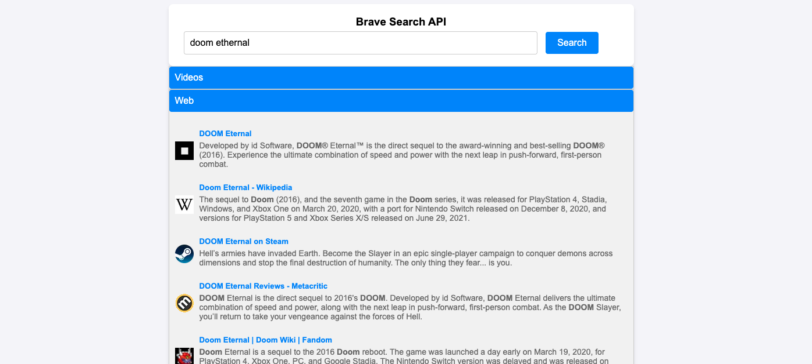

# My Web Search

My Web Search is a simple web application built with Deno 2 that allows users to search the web using the [Brave Search API](https://brave.com/search/api/). The application serves a static HTML page with a search input and displays the results in an accordion format.

## Features
- Search the web using the Brave API.
- Results are displayed in two categories: Videos and Web.
- Accordion-style UI to toggle between results.
- Minimal and modern design.

## Project Structure
```
my-web-search/
├── deno.json         # Deno configuration file
├── main.ts           # Main server file
├── routes.ts         # API routes
├── types.ts          # Type definitions
├── doc/              # Documentation assets
│   └── search.png    # Example screenshot
├── static/           # Static files
│   ├── index.html    # HTML file for the UI
│   └── style.css     # CSS file for styling
```

## Prerequisites
- [Deno 2](https://deno.com/) installed on your system.
- A Brave API key. 

## Setup
1. Clone the repository:
2. Set up the BRAVE_API_KEYin .env file:
3. Run the application with `deno task dev`
4. Open your browser and navigate to `http://localhost:3000`.

## License
This project is licensed under the MIT License. See the LICENSE file for details.